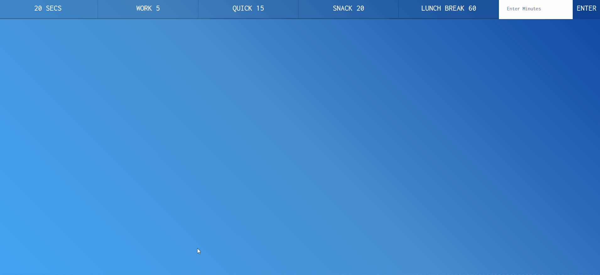

# Task 2: Countdown App

-   Open the `task-2-countdown-app` folder in VS Code and open the `index.html` file in your browser.
-   You should see a countdown app with multiple countdown timers.
-   Your task is to make the countdown timers work.
-   For this task, you will need to edit the just the `script.js` file.

-   **_Hint:_** Look up the [Date](https://developer.mozilla.org/en-US/docs/Web/JavaScript/Reference/Global_Objects/Date) object in JavaScript.
-   **_Hint:_** Look up the [setInterval](https://developer.mozilla.org/en-US/docs/Web/API/WindowOrWorkerGlobalScope/setInterval) method in JavaScript.
-   **_Hint:_** Look up the [setTimeout](https://developer.mozilla.org/en-US/docs/Web/API/WindowOrWorkerGlobalScope/setTimeout) method in JavaScript.
-   **_Hint:_** Look up the [querySelector](https://developer.mozilla.org/en-US/docs/Web/API/Document/querySelector) method in JavaScript.
-   **_Hint:_** Look up the [querySelectorAll](https://developer.mozilla.org/en-US/docs/Web/API/Document/querySelectorAll) method in JavaScript.
-   **_Hint:_** Look up the [addEventListener](https://developer.mozilla.org/en-US/docs/Web/API/EventTarget/addEventListener) method in JavaScript.
-   **_Hint:_** Look up the [textContent](https://developer.mozilla.org/en-US/docs/Web/API/Node/textContent) property in JavaScript.
-   **_Hint:_** Look up the [classList](https://developer.mozilla.org/en-US/docs/Web/API/Element/classList) property in JavaScript.

-   Here is a GIF of the expected result:

